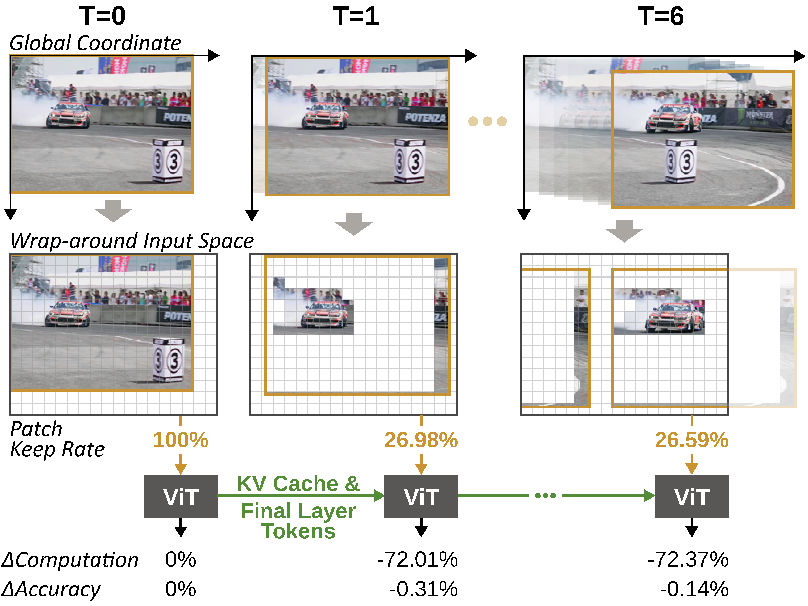

# Ouroboros

Official implementation of **Ouroboros: Instilling Motion Awareness in ViTs for Efficient Video Analytics on the Edge**, published at **MobiSys '26**.

[](https://doi.org/10.1145/3745756.3809212)
[](LICENSE)

<p align="center">
  
</p>

## Overview

Ouroboros is a motion-aware video analytics framework for Vision Transformers (ViTs) on edge platforms. Instead of recomputing every patch in every frame, Ouroboros uses motion vectors from hardware-accelerated video encoders to align temporally redundant content across frames. It then recomputes only non-redundant patches while preserving ViT spatial semantics through a toroidal input space and position-encoding reassignment.

The repository contains two complementary execution paths:

- `on_device/`: on-device evaluation, latency, power, and accuracy measurement scripts for ViT-based video analytics.
- `offload/`: client-server offloading prototype that transmits only the necessary video/frame information and runs server-side inference.

Ouroboros accelerates inference by up to **2.61x** and reduces energy consumption by **64.5%** on NVIDIA Jetson Orin devices, with less than **1%** accuracy loss on object detection and instance segmentation in the reported evaluation.

## Abstract

While Vision Transformers (ViTs) have emerged as foundation models for visual recognition, their high computational demands hinder deployment on edge platforms. Temporal redundancy across video frames offers a natural opportunity to reuse prior computations; however, existing methods remain far from ideal, often relying on simple frame-difference signals.

To address this, we propose Ouroboros, a framework that encompasses geometric redundancy from spatial displacement of content. We achieve this by aligning invariant content to consistent coordinates across frames, enabled by warping each frame into a global coordinate system via motion vectors from a hardware-accelerated encoder. Yet, this design raises two key challenges: preserving content that drifts out of the limited coordinate system and maintaining spatial continuity at frame borders.

Ouroboros resolves these challenges by introducing a toroidal input space and reassigning positional encodings to track displaced content. Leveraging significant patch reduction via a system-efficient partial computation scheme, Ouroboros accelerates inference and reduces energy consumption on NVIDIA Jetson Orin devices while preserving accuracy. Designed to process only non-redundant patches, Ouroboros also serves as an efficient offloading system, achieving higher accuracy at lower bandwidth than prior schemes.

## Repository Structure

```text
.
|-- figure_1.png                  # Overview figure
|-- on_device/                    # On-device evaluation and measurement
|   |-- evaluate.py               # DAVIS evaluation entry point
|   |-- evaluate_imvid.py         # ImageNet VID evaluation entry point
|   |-- latency_measure.py        # Latency measurement
|   |-- measure_latmempow.py      # Latency, memory, and power measurement
|   |-- custom_h264/, custom_h265/# Motion-vector encoder helpers
|   `-- ipconv/models/            # Context-aware ViT/Detector model variants
`-- offload/                      # Edge-to-server offloading prototype
    |-- client.py                 # Video sender / edge client
    |-- server.py                 # Inference server
    |-- preprocessing.py          # Alignment, padding, and dirtiness maps
    |-- networking.py             # Dual TCP communication utilities
    `-- custom_h264/, custom_h265/# Motion-vector encoder helpers
```

## Setup

Ouroboros targets CUDA-capable machines and NVIDIA Jetson Orin-class edge devices. The motion-vector helpers also require FFmpeg development libraries available through `pkg-config`.

Install the Python dependencies in your preferred environment:

```bash
python -m venv .venv
source .venv/bin/activate
pip install torch torchvision opencv-python av numpy tqdm imageio torchmetrics fvcore pycocotools scipy
```

Build the custom encoder helpers used to extract motion vectors:

```bash
cd on_device/custom_h265
make

cd ../../offload/custom_h265
make
```

If you use the H.264 path, build the corresponding `custom_h264` helpers in the same way.

## Data and Weights

The evaluation scripts expect datasets and model weights to be placed under the repository root:

```text
data/
|-- DAVIS2017_trainval/
|   |-- JPEGImages/480p/
|   `-- Annotations/480p/
`-- vid/
    `-- vid_data.tar

weights/
|-- model_final_61ccd1.pkl  # ViTDet-B
|-- model_final_6146ed.pkl  # ViTDet-L
|-- model_final_7224f1.pkl  # ViTDet-H
|-- model_final_246a82.pkl  # Swin-B
|-- model_final_7c897e.pkl  # Swin-L
`-- model_final_8c3da3.pkl  # MViT-B
```

The paths above match the defaults in `on_device/evaluate_funcs.py`.

For the offloading demo, place or symlink the ViTDet-B checkpoint at:

```text
offload/models/model_final_61ccd1.pkl
```

## On-Device Evaluation

Run DAVIS evaluation:

```bash
python on_device/evaluate.py \
  --model vitdet-b \
  --dataset DAVIS2017_trainval \
  --frame-rates 30 \
  --method ours \
  --dmap-type threshold \
  --dirty-thres 30 \
  --device cuda:0
```

Run ImageNet VID evaluation:

```bash
python on_device/evaluate_imvid.py \
  --model vitdet-b \
  --dataset imnet-vid \
  --frame-rates 30 \
  --method ours \
  --dmap-type topk \
  --dirty-topk 128 \
  --device cuda:0
```

Supported methods include `ours`, `evit`, `maskvd`, and `stgt`. Outputs are written under `output/`.

## Offloading Prototype

Start the inference server:

```bash
cd offload
mkdir -p logs
python server.py --server-ip localhost --server-port 65432 --device cuda
```

In another terminal, start the client:

```bash
cd offload
python client.py \
  --server-ip localhost \
  --server-port 65432 \
  --video-path ./input.mp4 \
  --frame-rate 100 \
  --compress h264
```

The server writes latency logs to `offload/logs/server_log.csv` and produces an annotated `offload/inferenced.mp4`.

## Citation

If you use Ouroboros in your research, please cite:

```bibtex
@inproceedings{10.1145/3745756.3809212,
author = {Park, Chanjeong and Yang, Donggyu and Kwon, Sooyoung and Park, Gibum and Joe-Wong, Carlee and Lee, Kyunghan},
title = {Ouroboros: Instilling Motion Awareness in ViTs for Efficient Video Analytics on the Edge},
year = {2026},
isbn = {9798400720277},
publisher = {Association for Computing Machinery},
address = {New York, NY, USA},
url = {https://doi.org/10.1145/3745756.3809212},
doi = {10.1145/3745756.3809212},
abstract = {While Vision Transformers (ViTs) have emerged as foundation models for visual recognition, their high computational demands hinder deployment on edge platforms. Temporal redundancy across video frames offers a natural opportunity to reuse prior computations; however, existing methods remain far from ideal, often relying on simple frame-difference signals. To address this, we propose Ouroboros, a framework that encompasses geometric redundancy from spatial displacement of content. We achieve this by aligning invariant content to consistent coordinates across frames, enabled by warping each frame into a global coordinate system via motion vectors from a hardware-accelerated encoder. Yet, this design raises two key challenges: (i) preserving content that drifts out of the limited coordinate system and (ii) maintaining spatial continuity at frame borders. Ouroboros resolves these challenges by introducing a toroidal (i.e., wrap-around) input space and reassigning positional encodings to track displaced content. Leveraging the significant patch reduction via a system-efficient partial computation scheme, our approach accelerates inference by up to 2.61\texttimes{} and reduces energy consumption by 64.5\% on NVIDIA Jetson Orin devices, with <1\% accuracy loss on object detection and instance segmentation, outperforming prior methods. Designed to process only non-redundant patches, Ouroboros also excels as an offloading system, yielding higher accuracy at lower bandwidth compared to prior schemes. The source code is available at https://github.com/ckswjd99-lab/Ouroboros.},
booktitle = {Proceedings of the 24th Annual International Conference on Mobile Systems, Applications and Services},
pages = {405--417},
numpages = {13},
keywords = {vision transformer, video analytics, temporal redundancy, on-device inference, offloading system},
location = {University of Cambridge, Cambridge, United Kingdom},
series = {MobiSys '26}
}
```

## License

This project is released under the [MIT License](LICENSE).
